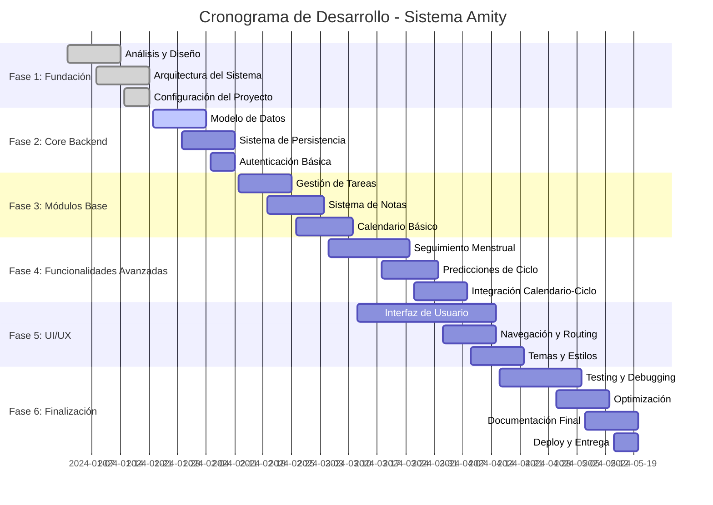
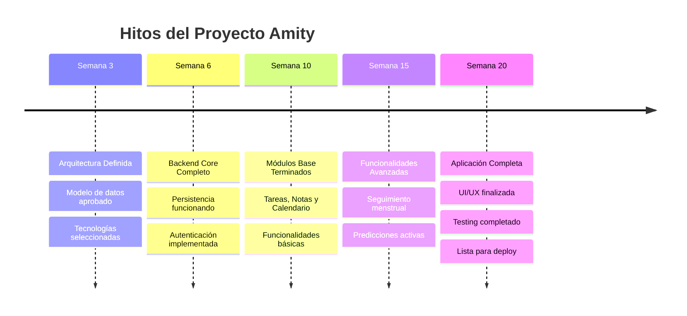

# Cronograma de Desarrollo - Amity

## Recomendación de Renderizado
**Recomiendo usar Mermaid** para renderizar este cronograma. Mermaid es ampliamente soportado por:
- GitHub (renderizado automático)
- GitLab
- Notion
- VS Code (con extensión)
- Muchas plataformas de documentación

Alternativamente, puedes usar:
- **Marp** para presentaciones
- **PlantUML** (también soporta Gantt)
- **Draw.io** para edición visual

---

## Cronograma General (12 semanas)

---

## Desglose por Fases

### Fase 1: Fundación (3 semanas)
| Tarea | Duración | Entregables |
|-------|----------|-------------|
| Análisis y Diseño | 2 semanas | Especificaciones funcionales, Historias de usuario |
| Arquitectura del Sistema | 2 semanas | Diagramas de arquitectura, Modelo de datos |
| Configuración del Proyecto | 1 semana | Proyecto base configurado, CI/CD básico |

### Fase 2: Core Backend (3 semanas)
| Tarea | Duración | Entregables |
|-------|----------|-------------|
| Modelo de Datos | 2 semanas | Entidades definidas, Interfaces TypeScript |
| Sistema de Persistencia | 2 semanas | Zustand Store, AsyncStorage integration |
| Autenticación Básica | 1 semana | Login/logout, Gestión de sesión |

### Fase 3: Módulos Base (4 semanas)
| Tarea | Duración | Entregables |
|-------|----------|-------------|
| Gestión de Tareas | 2 semanas | CRUD tareas, Estadísticas básicas |
| Sistema de Notas | 2 semanas | CRUD notas, Búsqueda simple |
| Calendario Básico | 2 semanas | Vista mensual, Gestión de eventos |

### Fase 4: Funcionalidades Avanzadas (5 semanas)
| Tarea | Duración | Entregables |
|-------|----------|-------------|
| Seguimiento Menstrual | 3 semanas | Registro de ciclos, Síntomas, Estados |
| Predicciones de Ciclo | 2 semanas | Algoritmos de predicción, Cálculos |
| Integración Calendario-Ciclo | 2 semanas | Sincronización automática |

### Fase 5: UI/UX (5 semanas)
| Tarea | Duración | Entregables |
|-------|----------|-------------|
| Interfaz de Usuario | 5 semanas | Pantallas completas, Componentes |
| Navegación y Routing | 2 semanas | Expo Router configurado |
| Temas y Estilos | 2 semanas | Modo claro/oscuro, Responsive design |

### Fase 6: Finalización (5 semanas)
| Tarea | Duración | Entregables |
|-------|----------|-------------|
| Testing y Debugging | 3 semanas | Tests unitarios, Corrección de bugs |
| Optimización | 2 semanas | Performance, Carga optimizada |
| Documentación Final | 2 semanas | Manual de usuario, Documentación técnica |
| Deploy y Entrega | 1 semana | App store ready, Entrega final |

---

## Hitos Principales

---

## Recursos y Equipo

### Perfiles Requeridos
- **1 Desarrollador Full-Stack** (React Native/TypeScript)
- **1 UI/UX Designer** (50% tiempo)
- **1 Product Owner** (25% tiempo)

### Tecnologías Clave
- React Native + Expo
- TypeScript
- Zustand (Estado)
- AsyncStorage (Persistencia)
- React Native Calendars

---

## Riesgos y Mitigaciones

| Riesgo | Probabilidad | Impacto | Mitigación |
|--------|-------------|---------|------------|
| Complejidad algoritmos menstruales | Media | Alto | Investigación previa, consulta médica |
| Problemas de rendimiento | Baja | Medio | Testing continuo, optimización temprana |
| Integración calendario compleja | Media | Medio | Prototipo temprano, testing frecuente |
| Cambios en requerimientos | Alta | Medio | Desarrollo ágil, sprints cortos |

---

## Entregables por Sprint (2 semanas)

### Sprint 1-2: Fundación
- [x] Análisis completo
- [x] Arquitectura definida
- [x] Proyecto configurado

### Sprint 3-4: Backend Core
- [ ] Modelos de datos
- [ ] Persistencia básica
- [ ] Autenticación

### Sprint 5-6: Módulos Base
- [ ] Sistema de tareas
- [ ] Sistema de notas
- [ ] Calendario básico

### Sprint 7-8: Avanzado
- [ ] Seguimiento menstrual
- [ ] Predicciones
- [ ] Integración

### Sprint 9-10: UI/UX
- [ ] Interfaces completas
- [ ] Navegación
- [ ] Temas visuales

### Sprint 11-12: Finalización
- [ ] Testing exhaustivo
- [ ] Optimización
- [ ] Documentación
- [ ] Deploy

---

## Métricas de Progreso

- **Cobertura de funcionalidades**: 100% de historias de usuario implementadas
- **Quality Gate**: 0 bugs críticos, <5 bugs menores
- **Performance**: Tiempo de carga <2 segundos
- **Testing**: >80% cobertura de código
- **Documentación**: 100% APIs documentadas

Este cronograma proporciona una estructura realista para el desarrollo completo del sistema Amity en aproximadamente 20 semanas (5 meses).
