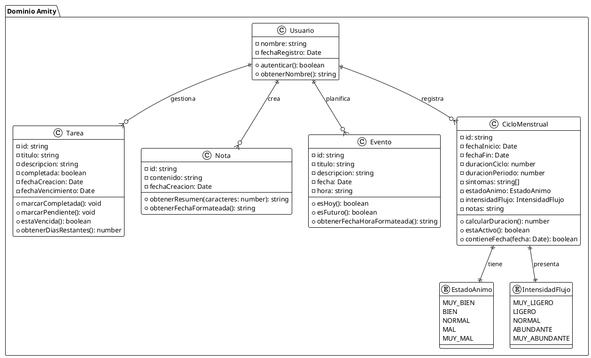
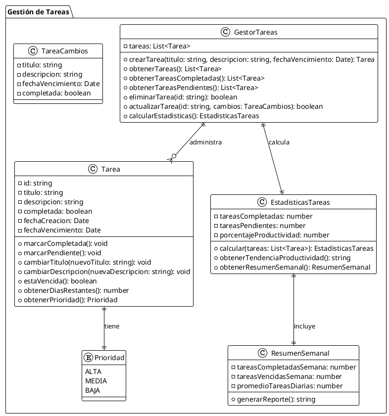
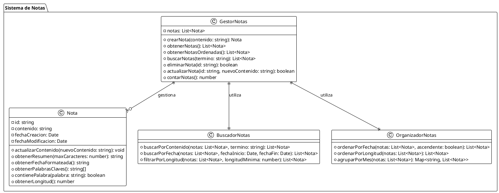
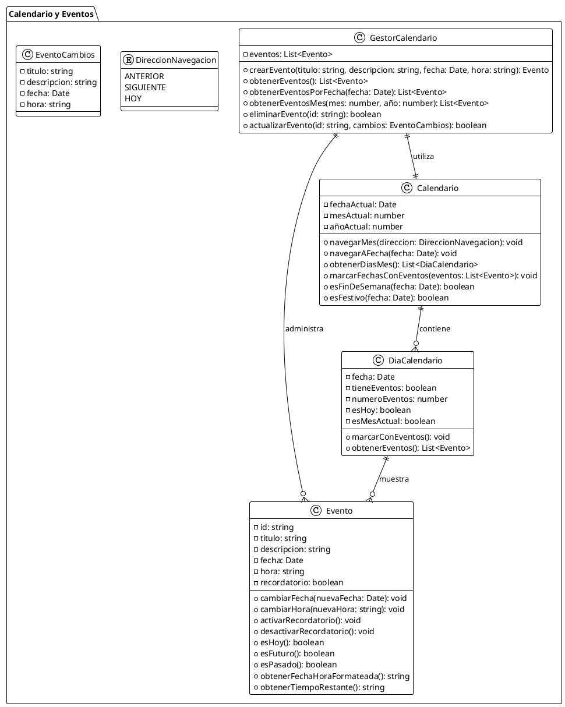
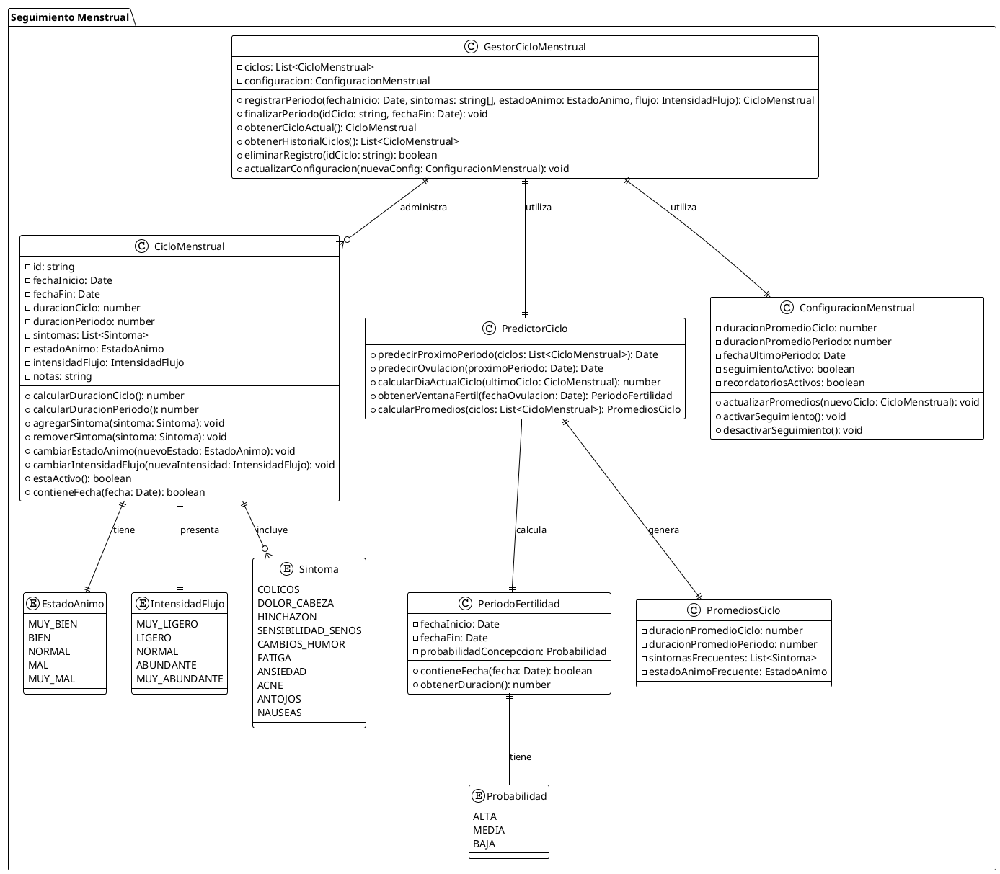
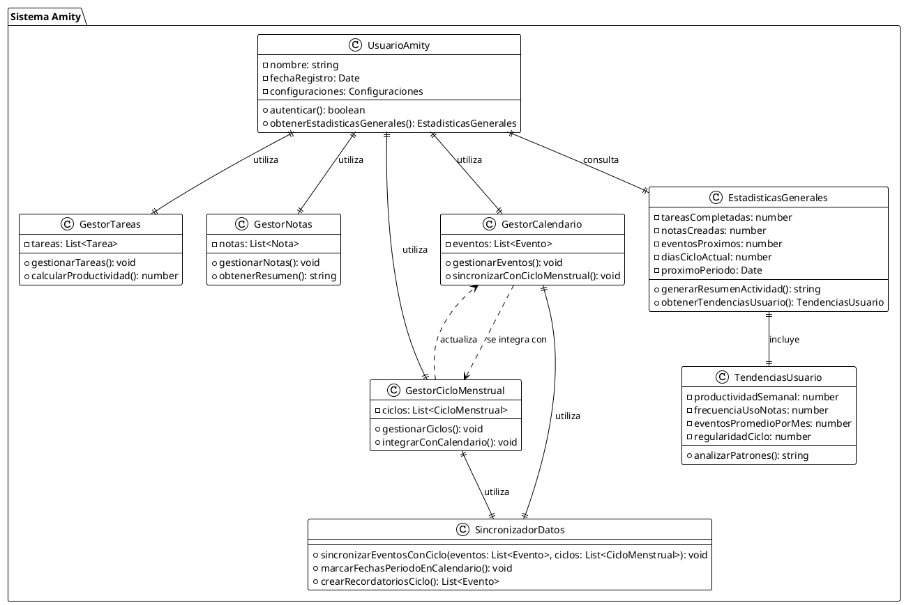

# Diagramas de Clases - Amity (Funcionalidades de Negocio)

## Índice
1. [Diagrama de Entidades Principales](#diagrama-de-entidades-principales)
2. [Diagrama de Gestión de Tareas](#diagrama-de-gestión-de-tareas)
3. [Diagrama de Sistema de Notas](#diagrama-de-sistema-de-notas)
4. [Diagrama de Calendario y Eventos](#diagrama-de-calendario-y-eventos)
5. [Diagrama de Ciclo Menstrual](#diagrama-de-ciclo-menstrual)
6. [Diagrama de Relaciones Generales](#diagrama-de-relaciones-generales)

---

## Diagrama de Entidades Principales

Este diagrama muestra las entidades principales del dominio de negocio de Amity.

---

## Diagrama de Gestión de Tareas

Este diagrama se centra específicamente en la funcionalidad de gestión de tareas.

---

## Diagrama de Sistema de Notas

Este diagrama representa la funcionalidad del sistema de notas.

---

## Diagrama de Calendario y Eventos

Este diagrama muestra la funcionalidad del calendario y gestión de eventos.

---

## Diagrama de Ciclo Menstrual

Este diagrama representa la funcionalidad especializada del seguimiento menstrual.

---

## Diagrama de Relaciones Generales

Este diagrama muestra cómo interactúan todas las funcionalidades principales de Amity.

---

## Resumen de Funcionalidades

### Gestión de Tareas
- Crear, completar y eliminar tareas
- Seguimiento de productividad con estadísticas
- Gestión de fechas de vencimiento

### Sistema de Notas
- Creación y gestión de notas de texto libre
- Búsqueda y organización por fecha
- Resúmenes automáticos de contenido

### Calendario y Eventos
- Planificación de eventos con fecha y hora
- Navegación mensual interactiva
- Integración con ciclo menstrual

### Seguimiento Menstrual
- Registro de períodos con síntomas y estado de ánimo
- Predicciones automáticas de próximo período y ovulación
- Cálculo de promedios y tendencias del ciclo
- Configuración personalizable de seguimiento

Todas estas funcionalidades están diseñadas para trabajar de forma integrada, proporcionando una experiencia completa de gestión personal y bienestar.
