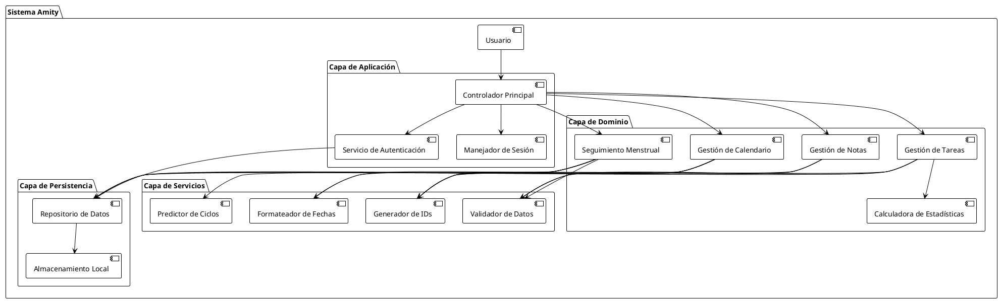
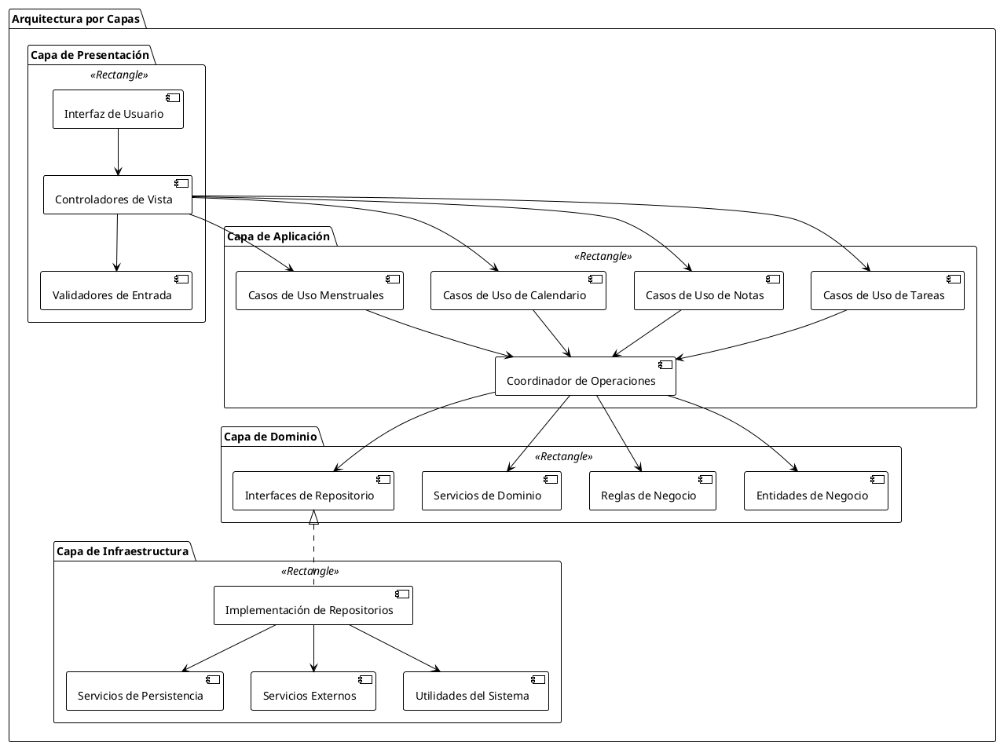
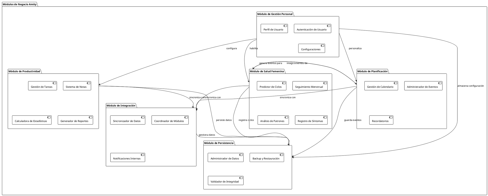
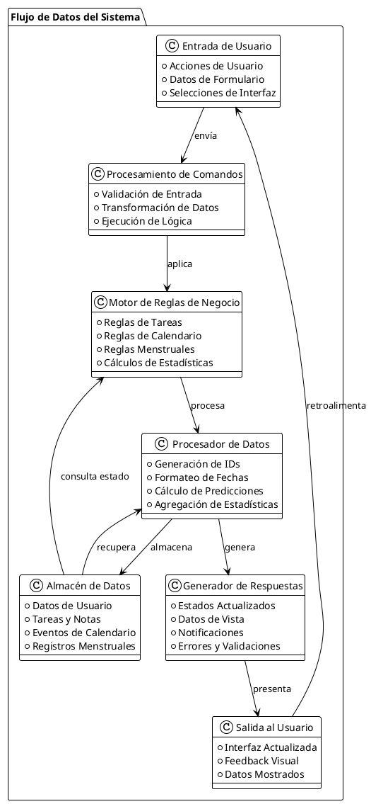
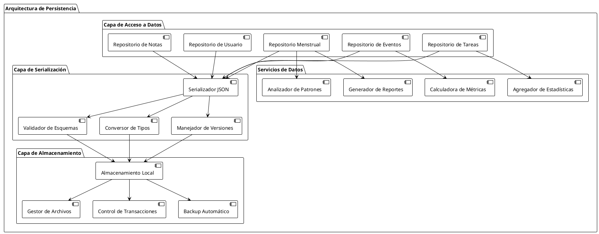
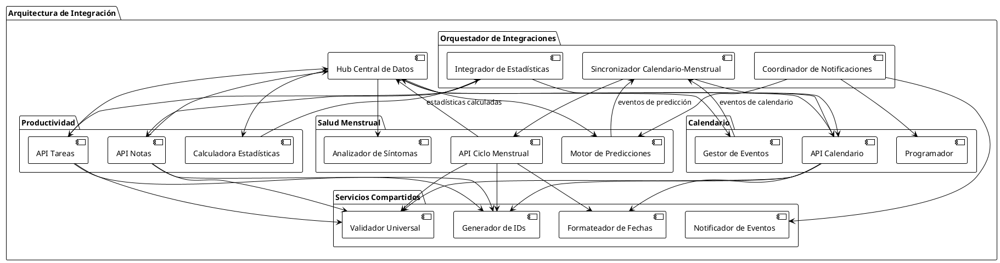

# Diagrama de Arquitectura del Sistema - Amity

## Índice
1. [Arquitectura General del Sistema](#arquitectura-general-del-sistema)
2. [Arquitectura de Capas](#arquitectura-de-capas)
3. [Arquitectura de Módulos de Negocio](#arquitectura-de-módulos-de-negocio)
4. [Flujo de Datos](#flujo-de-datos)
5. [Arquitectura de Persistencia](#arquitectura-de-persistencia)
6. [Arquitectura de Integración](#arquitectura-de-integración)

---

## Arquitectura General del Sistema

Este diagrama muestra la vista general de la arquitectura del sistema Amity enfocada en la lógica de negocio.

---

## Arquitectura de Capas

Este diagrama detalla la separación por capas del sistema.

---

## Arquitectura de Módulos de Negocio

Este diagrama muestra la organización de los módulos principales del negocio.

---

## Flujo de Datos

Este diagrama ilustra cómo fluyen los datos a través del sistema.

---

## Arquitectura de Persistencia

Este diagrama muestra cómo se manejan los datos en el sistema.

---

## Arquitectura de Integración

Este diagrama muestra cómo se integran los diferentes módulos del sistema.

---

## Resumen Arquitectónico

### Principios de Diseño
- **Separación de Responsabilidades**: Cada módulo tiene una función específica y bien definida
- **Bajo Acoplamiento**: Los módulos se comunican a través de interfaces bien definidas
- **Alta Cohesión**: Funcionalidades relacionadas están agrupadas en el mismo módulo
- **Inversión de Dependencias**: Los módulos de alto nivel no dependen de detalles de implementación

### Características Principales
- **Arquitectura Modular**: Organización en módulos independientes pero integrados
- **Flujo de Datos Unidireccional**: Datos fluyen de manera predecible a través del sistema
- **Persistencia Local**: Almacenamiento completamente local sin dependencias externas
- **Integración Inteligente**: Sincronización automática entre calendario y ciclo menstrual

### Escalabilidad
- **Módulos Extensibles**: Fácil adición de nuevas funcionalidades
- **Servicios Reutilizables**: Componentes compartidos entre módulos
- **Arquitectura por Capas**: Separación clara entre lógica de negocio y persistencia
- **Patrones de Integración**: Comunicación estandarizada entre módulos

Esta arquitectura garantiza un sistema robusto, mantenible y escalable centrado en las necesidades del usuario final.
