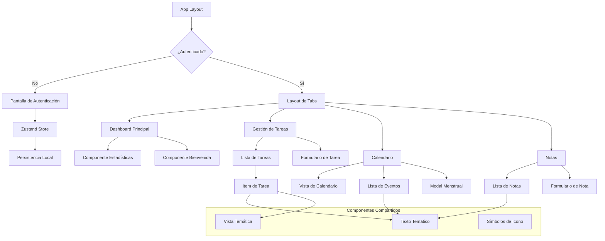

# Documentación Técnica - Amity

## Índice
1. [Descripción General](#descripción-general)
2. [Arquitectura del Sistema](#arquitectura-del-sistema)
3. [Tecnologías Utilizadas](#tecnologías-utilizadas)
4. [Estructura de Archivos](#estructura-de-archivos)
5. [Funcionalidades Principales](#funcionalidades-principales)
6. [Implementación Técnica](#implementación-técnica)
7. [Gestión de Estado](#gestión-de-estado)
8. [Navegación y Routing](#navegación-y-routing)
9. [Persistencia de Datos](#persistencia-de-datos)
10. [Interfaz de Usuario](#interfaz-de-usuario)
11. [Casos de Uso](#casos-de-uso)
12. [Diagrama de Componentes](#diagrama-de-componentes)
13. [Historias de Usuario](#historias-de-usuario)

---

## Descripción General

**Amity** es una aplicación móvil multiplataforma desarrollada con React Native y Expo, diseñada como un asistente personal integral para la gestión de productividad y bienestar femenino. La aplicación combina funcionalidades de gestión de tareas, notas, calendario y seguimiento del ciclo menstrual en una sola plataforma.

### Objetivo Principal
Proporcionar una herramienta unificada que permita a las usuarias organizar su vida diaria mientras mantienen un registro de su salud reproductiva, todo con persistencia local de datos para garantizar privacidad y disponibilidad offline.

---

## Arquitectura del Sistema

### Patrón de Arquitectura
La aplicación sigue un patrón de **arquitectura basada en componentes** con **gestión de estado centralizada**, implementando los siguientes principios:

- **Separación de responsabilidades**: Cada módulo tiene una función específica
- **Estado unidireccional**: Flujo de datos predecible usando Zustand
- **Componentes reutilizables**: UI modular y escalable
- **Persistencia local**: Datos almacenados localmente usando AsyncStorage

### Capas de la Aplicación
1. **Capa de Presentación**: Componentes React Native y pantallas
2. **Capa de Lógica de Negocio**: Store de Zustand con acciones y estado
3. **Capa de Persistencia**: AsyncStorage para almacenamiento local
4. **Capa de Navegación**: Expo Router para ruteo file-based

---

## Tecnologías Utilizadas

### Framework Principal
- **React Native**: 0.79.2
- **Expo**: 53.0.9
- **TypeScript**: 5.3.3

### Gestión de Estado
- **Zustand**: 5.0.5 - Store global reactivo
- **Zustand Persist**: Middleware para persistencia automática

### Navegación
- **Expo Router**: 5.0.7 - Navegación file-based
- **React Navigation**: 7.0.14 - Navegación nativa

### UI y Styling
- **NativeWind**: 4.1.23 - Tailwind CSS para React Native
- **React Native Calendars**: 1.1310.0 - Componente de calendario
- **Expo Vector Icons**: 14.1.0 - Iconografía
- **Expo Symbols**: 0.4.4 - Símbolos del sistema

### Persistencia
- **AsyncStorage**: 2.1.2 - Almacenamiento local asíncrono

### Herramientas de Desarrollo
- **Metro**: Bundler de React Native
- **Babel**: Transpilador de JavaScript
- **Jest**: Framework de testing
- **ESLint**: Linting de código

---

## Estructura de Archivos

```
amity/
├── app/                          # Rutas de la aplicación (Expo Router)
│   ├── (clean)/                  # Grupo de rutas sin tabs
│   │   ├── _layout.tsx           # Layout para pantallas de auth
│   │   └── auth.tsx              # Pantalla de autenticación
│   ├── (tabs)/                   # Grupo de rutas con tabs
│   │   ├── _layout.tsx           # Layout con navegación por tabs
│   │   ├── index.tsx             # Pantalla principal (inicio)
│   │   ├── tasks.tsx             # Gestión de tareas
│   │   ├── calendar.tsx          # Calendario y ciclo menstrual
│   │   └── notes.tsx             # Gestión de notas
│   ├── _layout.tsx               # Layout raíz de la aplicación
│   ├── +not-found.tsx            # Página 404
│   └── global.css                # Estilos globales
├── components/                   # Componentes reutilizables
│   ├── ui/                       # Componentes de UI específicos
│   │   ├── IconSymbol.tsx        # Componente de iconos
│   │   └── TabBarBackground.tsx  # Fondo de la barra de tabs
│   ├── ThemedText.tsx            # Texto con tema automático
│   ├── ThemedView.tsx            # Vista con tema automático
│   └── [otros componentes]       # Componentes auxiliares
├── store/                        # Gestión de estado
│   └── useAppStore.ts            # Store principal con Zustand
├── types/                        # Definiciones de TypeScript
│   └── index.ts                  # Interfaces y tipos principales
├── constants/                    # Constantes de la aplicación
│   ├── Colors.ts                 # Paleta de colores por tema
│   └── AppConstants.ts           # Constantes generales
├── hooks/                        # Custom hooks
│   ├── useColorScheme.ts         # Hook para tema claro/oscuro
│   └── useThemeColor.ts          # Hook para colores temáticos
├── assets/                       # Recursos estáticos
│   ├── images/                   # Imágenes y logos
│   └── fonts/                    # Fuentes tipográficas
└── [archivos de configuración]   # Babel, Metro, TypeScript, etc.
```

---

## Funcionalidades Principales

### 1. Autenticación Simple
- **Objetivo**: Personalizar la experiencia sin comprometer la privacidad
- **Implementación**: Registro simple con nombre de usuario
- **Persistencia**: Estado de autenticación guardado localmente
- **Navegación**: Redirección automática basada en estado de auth

### 2. Gestión de Tareas (Tasks)
- **Crear tareas**: Título, descripción opcional y fecha de vencimiento
- **Marcar como completadas**: Toggle de estado con persistencia
- **Eliminar tareas**: Confirmación antes de eliminación
- **Estadísticas**: Cálculo automático de productividad y progreso

### 3. Sistema de Notas
- **Crear notas**: Contenido libre con timestamp automático
- **Visualización**: Lista cronológica con fecha de creación
- **Eliminar notas**: Confirmación antes de eliminación
- **Persistencia**: Almacenamiento automático en AsyncStorage

### 4. Calendario Integral
- **Visualización mensual**: Calendario interactivo con marcadores
- **Eventos personalizados**: Título, descripción, fecha y hora opcional
- **Navegación por fechas**: Selección de día con información detallada
- **Interfaz responsive**: Adaptación a diferentes tamaños de pantalla

### 5. Seguimiento del Ciclo Menstrual
- **Registro de períodos**: Fecha de inicio con cálculo automático
- **Seguimiento de síntomas**: Selección múltiple de síntomas comunes
- **Estado de ánimo**: Escala emocional de 5 niveles
- **Intensidad del flujo**: 5 niveles de intensidad con emojis
- **Predicciones**: Cálculo automático del próximo período y ovulación
- **Notas personales**: Campo libre para observaciones adicionales

### 6. Dashboard de Productividad
- **Estadísticas en tiempo real**: Tareas completadas vs pendientes
- **Porcentaje de productividad**: Cálculo automático basado en completación
- **Bienvenida personalizada**: Saludo con nombre del usuario
- **Información del ciclo**: Día actual del ciclo y próximo período

---

## Implementación Técnica

### Gestión de Estado con Zustand

El store principal (`useAppStore.ts`) centraliza todo el estado de la aplicación:

```typescript
interface AppStoreState extends AppState {
  // Estado de datos
  tasks: Task[];
  notes: Note[];
  calendarEvents: CalendarEvent[];
  menstrualCycles: MenstrualCycle[];
  menstrualSettings: MenstrualSettings;
  
  // Acciones CRUD
  addTask: (title: string, description: string, dueDate?: Date) => void;
  toggleTask: (taskId: string) => void;
  deleteTask: (taskId: string) => void;
  
  // Funciones especializadas
  getPredictedNextPeriod: () => string | null;
  getCurrentCycleDay: () => number | null;
  updateStats: () => void;
}
```

#### Características del Store:
- **Persistencia automática**: Middleware de Zustand-persist con AsyncStorage
- **Generación de IDs únicos**: Función `generateId()` basada en timestamp
- **Cálculos automáticos**: Estadísticas y predicciones del ciclo menstrual
- **Estado inmutable**: Actualizaciones usando patrones inmutables

### Tipos de Datos

#### Task (Tarea)
```typescript
interface Task {
  id: string;
  title: string;
  description: string;
  completed: boolean;
  createdAt: Date;
  dueDate?: Date;
}
```

#### Note (Nota)
```typescript
interface Note {
  id: string;
  content: string;
  createdAt: Date;
}
```

#### CalendarEvent (Evento de Calendario)
```typescript
interface CalendarEvent {
  id: string;
  title: string;
  description: string;
  date: string;
  time?: string;
}
```

#### MenstrualCycle (Ciclo Menstrual)
```typescript
interface MenstrualCycle {
  id: string;
  startDate: string;
  endDate?: string;
  cycleLength: number;
  periodLength: number;
  symptoms: string[];
  mood: 'muy_bien' | 'bien' | 'normal' | 'mal' | 'muy_mal';
  flow: 'muy_ligero' | 'ligero' | 'normal' | 'abundante' | 'muy_abundante';
  notes?: string;
  createdAt: Date;
}
```

### Algoritmos de Predicción Menstrual

#### Predicción del Próximo Período
```typescript
getPredictedNextPeriod: () => {
  const lastCycle = menstrualCycles[menstrualCycles.length - 1];
  const lastPeriodDate = new Date(lastCycle.startDate);
  const nextPeriodDate = new Date(lastPeriodDate);
  nextPeriodDate.setDate(lastPeriodDate.getDate() + averageCycleLength);
  return nextPeriodDate.toISOString().split('T')[0];
}
```

#### Cálculo del Día del Ciclo
```typescript
getCurrentCycleDay: () => {
  const lastCycle = menstrualCycles[menstrualCycles.length - 1];
  const today = new Date();
  const cycleStart = new Date(lastCycle.startDate);
  const daysDiff = Math.ceil((today.getTime() - cycleStart.getTime()) / (1000 * 60 * 60 * 24));
  return daysDiff > 0 ? daysDiff : 1;
}
```

#### Predicción de Ovulación
```typescript
isPredictedOvulation: (date: string) => {
  const ovulationDate = new Date(predictedStart);
  ovulationDate.setDate(ovulationDate.getDate() - 14); // 14 días antes del próximo período
  // Ventana de fertilidad de 3 días
  const ovulationStart = new Date(ovulationDate.getTime() - 24 * 60 * 60 * 1000);
  const ovulationEnd = new Date(ovulationDate.getTime() + 24 * 60 * 60 * 1000);
  return checkDate >= ovulationStart && checkDate <= ovulationEnd;
}
```

---

## Navegación y Routing

### Estructura de Navegación con Expo Router

La aplicación utiliza un sistema de navegación file-based con dos grupos principales:

#### Grupo Clean (Autenticación)
- **Ruta**: `(clean)/auth.tsx`
- **Propósito**: Pantalla de bienvenida y registro inicial
- **Layout**: Sin navegación por tabs
- **Redirección**: Automática a tabs una vez autenticado

#### Grupo Tabs (Aplicación Principal)
- **Layout**: `(tabs)/_layout.tsx` con navegación inferior
- **Rutas principales**:
  - `/` - Dashboard principal
  - `/tasks` - Gestión de tareas
  - `/calendar` - Calendario y ciclo menstrual
  - `/notes` - Sistema de notas

### Configuración de Tabs
```typescript
<Tabs screenOptions={{
  tabBarActiveTintColor: Colors[colorScheme ?? 'light'].tint,
  headerShown: false,
  tabBarButton: HapticTab, // Feedback háptico
  tabBarBackground: TabBarBackground, // Efecto blur en iOS
}}>
```

### Guards de Navegación
```typescript
useEffect(() => {
  if (isAuthenticated) {
    router.replace('/(tabs)');
  } else {
    router.replace('/(clean)/auth');
  }
}, [isAuthenticated]);
```

---

## Persistencia de Datos

### Configuración de AsyncStorage
```typescript
persist(
  (set, get) => ({ /* store logic */ }),
  {
    name: 'amity-storage',
    storage: createJSONStorage(() => AsyncStorage),
    partialize: (state) => ({
      isAuthenticated: state.isAuthenticated,
      userName: state.userName,
      tasks: state.tasks,
      notes: state.notes,
      calendarEvents: state.calendarEvents,
      menstrualCycles: state.menstrualCycles,
      menstrualSettings: state.menstrualSettings,
      stats: state.stats,
    }),
  }
)
```

### Estrategia de Persistencia
- **Automática**: Todos los cambios se guardan automáticamente
- **Selectiva**: Solo datos críticos se persisten (no estado temporal)
- **Resiliente**: Manejo de errores de escritura/lectura
- **Privada**: Almacenamiento completamente local

---

## Interfaz de Usuario

### Sistema de Temas
La aplicación soporta tema claro y oscuro automático:

```typescript
// Configuración de colores por tema
const Colors = {
  light: {
    text: '#11181C',
    background: '#fff',
    tint: '#0a7ea4',
    icon: '#687076',
    tabIconDefault: '#687076',
    tabIconSelected: '#0a7ea4',
    accent: '#FF6B9D',
    textDisabled: '#9BA1A6',
  },
  dark: {
    text: '#ECEDEE',
    background: '#151718',
    tint: '#fff',
    icon: '#9BA1A6',
    tabIconDefault: '#9BA1A6',
    tabIconSelected: '#fff',
    accent: '#FF6B9D',
    textDisabled: '#687076',
  },
};
```

### Componentes Temáticos
- **ThemedText**: Texto que se adapta al tema automáticamente
- **ThemedView**: Contenedor con fondo temático
- **IconSymbol**: Iconos del sistema con color temático

### Patrones de Diseño UI

#### Cards y Contenedores
```typescript
const styles = StyleSheet.create({
  taskComponent: { 
    flexDirection: "row",
    alignItems: "center",
    paddingVertical: 20, 
    paddingHorizontal: 20, 
    borderColor: "#ffffff20", 
    borderWidth: 1, 
    borderRadius: AppConstants.borderRadius,
  }
});
```

#### Sistema de Espaciado
- **Border Radius**: Consistente de 25px (`AppConstants.borderRadius`)
- **Padding**: Jerarquía de 8, 12, 15, 20px
- **Gaps**: Flexbox con gaps consistentes

#### Feedback Visual
- **Estados de loading**: Indicadores durante operaciones
- **Confirmaciones**: Alerts para acciones destructivas
- **Estados vacíos**: Mensajes informativos cuando no hay datos
- **Feedback háptico**: Vibraciones en interacciones importantes

---

## Casos de Uso

### Usuario Primera Vez
1. **Apertura de app** → Pantalla de autenticación
2. **Ingreso de nombre** → Validación y storage
3. **Redirección automática** → Dashboard principal
4. **Tour implícito** → Interfaz intuitiva sin onboarding

### Gestión Diaria de Tareas
1. **Acceso a la pestaña Tasks** → Lista de tareas existentes
2. **Creación de nueva tarea** → Formulario modal
3. **Completar tareas** → Toggle con feedback visual
4. **Eliminar tareas** → Confirmación de seguridad
5. **Visualización de progreso** → Dashboard actualizado automáticamente

### Seguimiento Menstrual
1. **Acceso al calendario** → Vista mensual con marcadores
2. **Selección de fecha** → Información del día
3. **Registro de período** → Modal especializado
4. **Selección de síntomas** → Interfaz multi-selección
5. **Guardado automático** → Persistencia inmediata
6. **Visualización de predicciones** → Cálculos automáticos

### Gestión de Eventos
1. **Navegación por calendario** → Selección de fecha
2. **Creación de evento** → Formulario contextual
3. **Visualización de eventos** → Lista por fecha seleccionada
4. **Eliminación** → Confirmación y actualización automática

---

## Diagrama de Componentes



---

## Historias de Usuario

### Epic: Gestión Personal de Productividad

#### HU-001: Registro de Usuario
**Como** una nueva usuaria  
**Quiero** registrarme con mi nombre  
**Para** personalizar mi experiencia en la aplicación  

**Criterios de Aceptación:**
- Puedo ingresar mi nombre en una pantalla de bienvenida
- El sistema guarda mi nombre localmente
- Soy redirigida automáticamente al dashboard principal
- Mi nombre aparece en el saludo personalizado

#### HU-002: Creación de Tareas
**Como** usuaria registrada  
**Quiero** crear tareas con título y descripción  
**Para** organizar mis pendientes diarios  

**Criterios de Aceptación:**
- Puedo acceder a un formulario de nueva tarea
- El título es obligatorio, la descripción es opcional
- La tarea se guarda automáticamente al confirmar
- Veo la nueva tarea en mi lista inmediatamente

#### HU-003: Completar Tareas
**Como** usuaria con tareas creadas  
**Quiero** marcar tareas como completadas  
**Para** hacer seguimiento de mi progreso  

**Criterios de Aceptación:**
- Puedo hacer clic en un checkbox para completar la tarea
- Las tareas completadas se muestran con estilo diferenciado
- Las estadísticas se actualizan automáticamente
- Puedo desmarcar una tarea si fue marcada por error

#### HU-004: Visualización de Progreso
**Como** usuaria activa  
**Quiero** ver estadísticas de mis tareas  
**Para** monitorear mi productividad  

**Criterios de Aceptación:**
- Veo el número de tareas completadas
- Veo el número de tareas pendientes
- Veo mi porcentaje de productividad
- Las estadísticas se actualizan en tiempo real

### Epic: Sistema de Notas

#### HU-005: Crear Notas Rápidas
**Como** usuaria  
**Quiero** crear notas de texto libre  
**Para** capturar ideas y recordatorios  

**Criterios de Aceptación:**
- Puedo escribir contenido libre en un campo de texto
- La nota se guarda con fecha y hora automática
- Veo todas mis notas en orden cronológico
- Puedo crear múltiples notas sin límite

#### HU-006: Eliminar Notas
**Como** usuaria con notas existentes  
**Quiero** eliminar notas que ya no necesito  
**Para** mantener organizada mi lista  

**Criterios de Aceptación:**
- Puedo eliminar una nota con confirmación
- La nota desaparece inmediatamente de la lista
- La eliminación es permanente
- Recibo confirmación antes de eliminar

### Epic: Calendario y Eventos

#### HU-007: Navegación por Calendario
**Como** usuaria  
**Quiero** navegar por un calendario mensual  
**Para** visualizar y planificar mis actividades  

**Criterios de Aceptación:**
- Veo un calendario mensual interactivo
- Puedo navegar entre meses
- Puedo seleccionar cualquier fecha
- Veo marcadores visuales en fechas con eventos

#### HU-008: Crear Eventos
**Como** usuaria  
**Quiero** crear eventos en fechas específicas  
**Para** planificar mis actividades  

**Criterios de Aceptación:**
- Puedo seleccionar una fecha y crear un evento
- Puedo agregar título, descripción y hora opcional
- El evento se marca visualmente en el calendario
- Veo los detalles del evento al seleccionar la fecha

### Epic: Seguimiento Menstrual

#### HU-009: Registro de Período
**Como** usuaria que menstrúa  
**Quiero** registrar el inicio de mi período  
**Para** hacer seguimiento de mi ciclo menstrual  

**Criterios de Aceptación:**
- Puedo seleccionar una fecha para registrar mi período
- Puedo indicar síntomas, estado de ánimo y flujo
- El período se marca visualmente en el calendario
- Puedo agregar notas personales opcionales

#### HU-010: Predicciones del Ciclo
**Como** usuaria con datos menstruales  
**Quiero** ver predicciones de mi próximo período  
**Para** planificar con anticipación  

**Criterios de Aceptación:**
- Veo la predicción de mi próximo período
- Veo en qué día del ciclo me encuentro actualmente
- Las predicciones se basan en mi historial personal
- Las fechas predichas se muestran en el calendario

#### HU-011: Seguimiento de Síntomas
**Como** usuaria que registra su período  
**Quiero** documentar síntomas y estado de ánimo  
**Para** identificar patrones en mi ciclo  

**Criterios de Aceptación:**
- Puedo seleccionar múltiples síntomas de una lista predefinida
- Puedo indicar mi estado de ánimo en una escala
- Puedo especificar la intensidad del flujo
- Todos los datos se guardan con la fecha correspondiente

### Epic: Experiencia de Usuario

#### HU-012: Tema Claro/Oscuro
**Como** usuaria  
**Quiero** que la app se adapte al tema de mi dispositivo  
**Para** tener una experiencia visual cómoda  

**Criterios de Aceptación:**
- La app detecta automáticamente el tema del sistema
- Todos los colores y textos se adaptan al tema
- El cambio de tema es instantáneo
- La legibilidad se mantiene en ambos temas

#### HU-013: Persistencia de Datos
**Como** usuaria  
**Quiero** que mis datos se guarden automáticamente  
**Para** no perder información al cerrar la app  

**Criterios de Aceptación:**
- Todos mis datos se guardan sin intervención manual
- Al reabrir la app, encuentro toda mi información
- Los datos se mantienen aunque se actualice la app
- No necesito crear cuentas ni sincronizar con servidores

#### HU-014: Navegación Intuitiva
**Como** usuaria  
**Quiero** navegar fácilmente entre las funciones  
**Para** acceder rápidamente a lo que necesito  

**Criterios de Aceptación:**
- Puedo acceder a todas las funciones desde tabs inferiores
- Los iconos son claros y representativos
- La navegación es consistente en toda la app
- Puedo volver atrás fácilmente en cualquier momento

---

## Conclusión

Amity representa una solución integral y moderna para la gestión personal, combinando tecnologías actuales de desarrollo móvil con un enfoque centrado en la usuaria. La arquitectura modular y la persistencia local garantizan una experiencia fluida, privada y confiable.

### Fortalezas Técnicas
- **Arquitectura escalable** con separación clara de responsabilidades
- **Estado predecible** con Zustand y patrones inmutables
- **Persistencia robusta** sin dependencias externas
- **UI responsiva** con soporte para temas automáticos
- **Tipado fuerte** con TypeScript para mayor confiabilidad

### Fortalezas de Producto
- **Funcionalidades integradas** que se complementan entre sí
- **Privacidad por diseño** con almacenamiento local exclusivo
- **Experiencia sin fricciones** con navegación intuitiva
- **Especialización en salud femenina** con algoritmos de predicción menstrual
- **Accesibilidad** con soporte para diferentes dispositivos y tamaños de pantalla

### Potencial de Expansión
La arquitectura actual permite fácilmente agregar:
- Notificaciones push para recordatorios
- Exportación de datos para análisis médico
- Integración con wearables para datos de salud
- Análisis avanzados de patrones menstruales
- Funciones de respaldo y restauración de datos

Esta documentación proporciona la base completa para el desarrollo de historias de usuario detalladas, diagramas de arquitectura de infraestructura y planificación de futuras iteraciones del producto.
